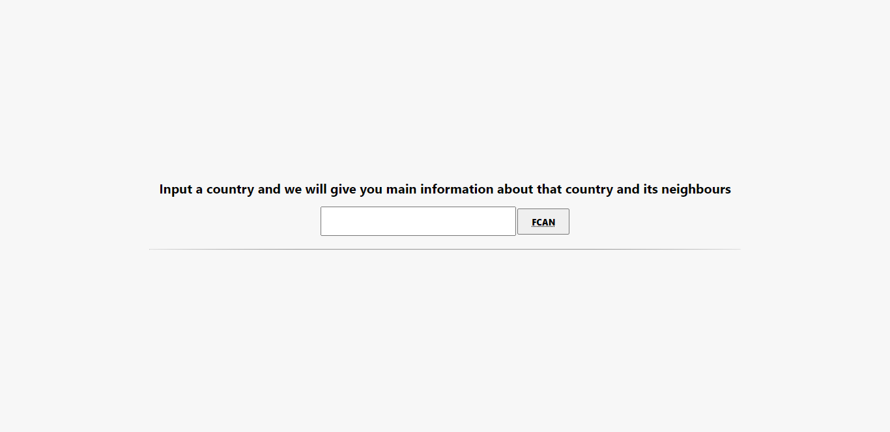
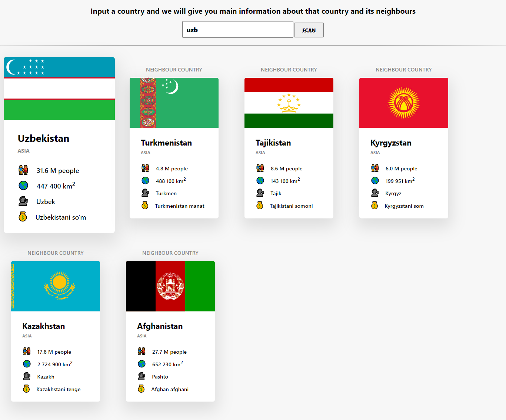
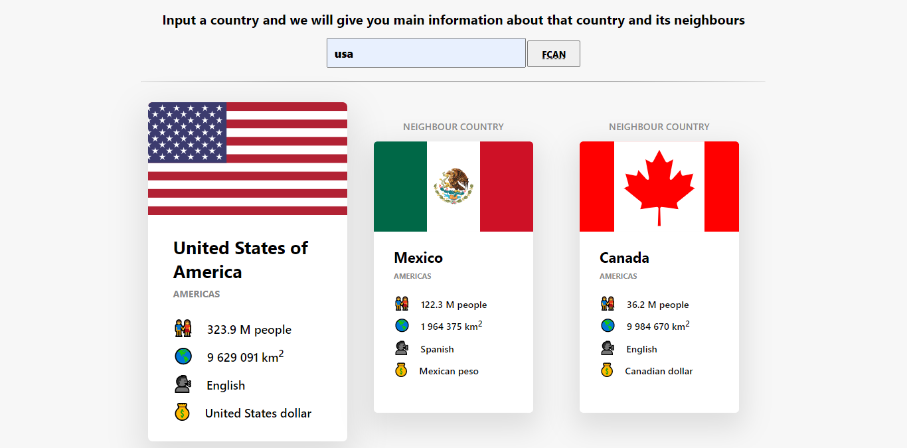
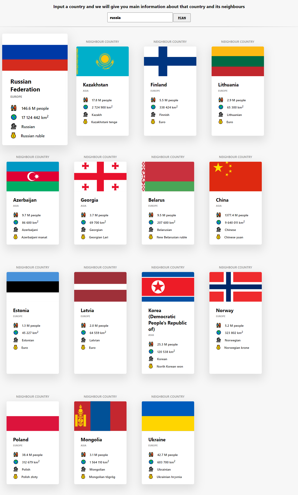
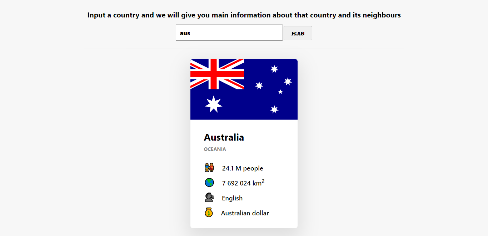

# rest countries
Just a small project, that is created in order to learn about AJAX, fetch, promises, async and await

There are couple of screenshots below

### The very first look:

### Results of searching

